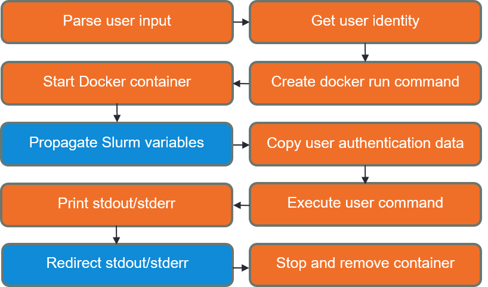

# hocker
Hocker is a Python 3 wrapper to enable secure Docker container usage in an HPC cluster.
</br></br>

## Description
Containers provide a lightweight and efficient solution for isolation within a high performance computing (HPC) cluster. With Docker as a containerization platform, building images is hassle-free for the administrator and running containers is simple and straightforward for the user.
</br>

However, Docker introduces a security challenge: When a user runs a container, the container is run as root. Thus, unprivileged users who have permission to run Docker commands are capable of gaining root access inside of containers. The issue this creates within an HPC environment is clear: Shared data not normally accessible to non-privileged users are accessible with the root privileges provided through Docker containers.
</br>

### How Hocker works
When a user executes the `hocker run` command, Hocker starts the user's specified Docker image. Hocker then copies user authentication data (such as `/etc/passwd` and `/etc/group`) from the host machine to the container. The user's command is then executed inside of the container with the user's UID and GID(s) from the host machine. Once the user's command is completed, Hocker stops and removes the container.
</br></br>

## Versatility
While Hocker is designed for an HPC cluster with the Slurm workload manager, Hocker can be used independently on one machine. Additionally, when implemented in an HPC cluster, Hocker can be used independent of the Slurm queue (i.e., Hocker can be used on individual compute nodes, much like usage when Hocker is installed on one machine). By using the modified installation, Hocker can be installed on any HPC cluster without some of the prerequisites required of the full installation.

### Installation types
* Full installation: For use on an HPC cluster
* Simple installation: For use on one machine
* Modified installation: Full installation without btools or Slurm
</br>

*Hocker has been tested on CentOS 7.5 with the Slurm workload manager.*
</br></br>

## Features
### All usage features
* Security within an HPC environment
   * Persistent UID and GID(s) inside of the container to enforce permissions
   * `hocker` group to limit users that have access to Hocker
   * Authorized images system to restrict Docker images available on each node
* Standard output/error are printed to the terminal
* Option to specify the shell to use inside of the container
* Option to set environment variables listed in a file inside of the container 
* `/home/user` is mounted to the container for convenience
* Error handling to stop and remove a container if an error appears

### Additional Slurm usage features
* Standard out/error are redirected to `-o` and `-e` options specified in SBATCH script
* All Slurm daemon output environment variables are set inside of the container
* `/home` is mounted to the container for reading data between users
</br></br>

## Flowchart
This flowchart shows the general outline of how Hocker works. Slurm features are shown in blue.</br></br>

</br>

## Usage
```
Usage:
   hocker <command> [<args>...]
   hocker [-v | --version]
   hocker [-h | --help]
      
Options:
   -v, --version  Show the current version of Hocker.
   -h, --help     Show this screen.
   
Commands:
   run            Run a command in a Docker container.
   images         Show the authorized images on a node.
      
Run 'hocker <command> --help' for more information on a command.
```
</br>

## Example Usage
Run the image `ubuntu:16.04` and execute `./my-script`:</br></br>
`$ hocker run ubuntu:16.04 ./my-script`</br></br>

Run the image `ubuntu:16.04` and execute the command `echo "Hocker rocks"`:</br></br>
`$ hocker run ubuntu:16.04 'echo "Hocker rocks"'`</br></br>

Run the image `ubuntu:14.04` and execute multiple commands:</br></br>
`$ hocker run ubuntu:14.04 'echo "Hope College" && pwd && whoami && touch /home/user/f'`</br></br>

Run the image `ubuntu:latest` and propagate environment variables inside of the container from variables listed in `env.file`:</br></br>
`$ hocker run ubuntu:latest 'echo "This is awesome"' --env-file=env.file`</br></br>

List the authorized images on the current node:</br></br>
`$ hocker images`</br></br>

List the authorized images on node `node21`:</br></br>
`$ hocker images --node=node21`</br>
</br></br>

## Prerequisites
### All installations
* Linux - tested distributions:
   * CentOS 7.5
* Docker
* [Python 3 and pip](https://github.com/hopehpc/installation-scripts/blob/master/install-python3)

### Full installation
* [btools](https://github.com/zachsnoek/btools)
* [Slurm](https://github.com/zachsnoek/slurm-centos7)
* NFS

### Modified installation
* NFS
</br></br>

## Installation

### Full installation
1. Run the installation script and choose `f` for full installation</br></br>
`$ ./install`</br></br>   

2. Populate the authorized images files created in `/admin/hocker-images` with the names of the images available for each node
</br></br>
For example, in `/admin/hocker-images/node02`:</br></br>
`myrepo/base:latest`</br>
`myrepo/ubuntu:16.04`</br>
`myrepo/python:3.4`</br></br>   

3. Add users to the `hocker` group that are allowed access to Hocker</br></br>
`$ usermod -aG hocker user`</br></br>   

4. Sync user account info across all of the compute nodes</br></br>
`$ bsync`</br></br>  

5. Add `/admin/hocker-images` to `/etc/exports` so that the authorized images files are available on each compute node</br></br>

### Simple installation
1. Run the installation script and choose `s` for simple installation</br></br>
`$ ./install`</br></br>   

2. Populate the authorized images file created in `/admin/hocker-images` with the names of the images available for the node
</br></br>
For example, in `/admin/hocker-images/node`</br></br>
`myrepo/base:latest`</br>
`myrepo/ubuntu:16.04`</br>
`myrepo/python:3.4`</br></br>   

3. Add users to the `hocker` group that are allowed access to Hocker</br></br>
`$ usermod -aG hocker user`
</br></br>   

### Modified installation
1. Run the installation script and choose `m` for modified installation</br></br>
`$ ./install`</br></br>   

2. Follow the modified installation [installation guide](modified-installation.md) to complete configuration
</br></br>   

## Further development
* Add capability to create interactive Slurm jobs in a container
* Add options to limit or specify CPU and memory of the container
   * Automate CPU and memory parameter creation based on options in SBATCH script for Slurm jobs 
* Develop a more streamlined authorized images system
* Create scripts to automate updating images on compute nodes
</br></br>

## Documentation
Please consult the documentation for detailed information.</br>
* [Administrator manual](https://docs.google.com/document/d/1aUpxebXy2XlmOoJVrcXv-YMo0Bh-uQFX93R1DGBs6Wo/edit?usp=sharing)
* [User manual](https://docs.google.com/document/d/1iSBxsa-8C5_52ov7Xo1fuoP8PtVPJsQKWwz340No_R0/edit?usp=sharing)
</br></br>

## Acknowledgments
Hocker was developed through the Summer Hope Academic Research Program in collaboration with Hope College Computing and Information Technology and the Midwest Undergraduate Computational Chemistry Consortium. 

### Socker
Hocker is based on [Socker 16.12](https://github.com/unioslo/socker) developed by the University of Oslo.

Socker was originally written in Python 2 for use on CentOS 6. Hocker is written in Python 3 to anticipate the lifetime of our cluster and future support from the Python Software Foundation. Our modifications additionally support use on CentOS 7.

In addition to porting Socker to Python 3, some notable modifications to Socker are included below.

* The method of accessing user information is modified to account for irregularities between the host machine and the `os` module
* Argument parsing through the `docopt` module is implemented to improve efficiency and increase the flexibility of the program
* The `docker exec` command is added to provide flexibility within Docker commands
* Authorized images are listed in files for each node within a directory, allowing for different nodes to run different images and the capability to search for authorized images on another node
* Standard out and standard error are passed appropriately to the calling shell by default and get included in the Slurm output and error files
* Various command line options are added for user convenience
</br></br>

## Contact
Zachary Snoek</br>
zachary.snoek@hope.edu</br></br>
Brent Krueger</br>
kruegerb@hope.edu</br></br>
Hope College Computing and Information Technology</br>
cit@hope.edu
</br></br>

## Conventions
* Hocker files</br>
  * The files contained in `/usr/bin/hocker1.0/files`</br>
* Hocker executable</br>
  * The executable created by PyInstaller (`/usr/bin/hocker1.0/hocker`)</br>
* Hocker bundle directory</br>
  * The bundled directory created by PyInstaller (`/usr/bin/hocker1.0`)</br>
* Authorized images files</br>
  * The files named for each compute node containing the names of the images available for each compute node</br>
* Authorized images directory</br>
  * The directory containing the authorized images files (`/admin/hocker-images`)
</br>
